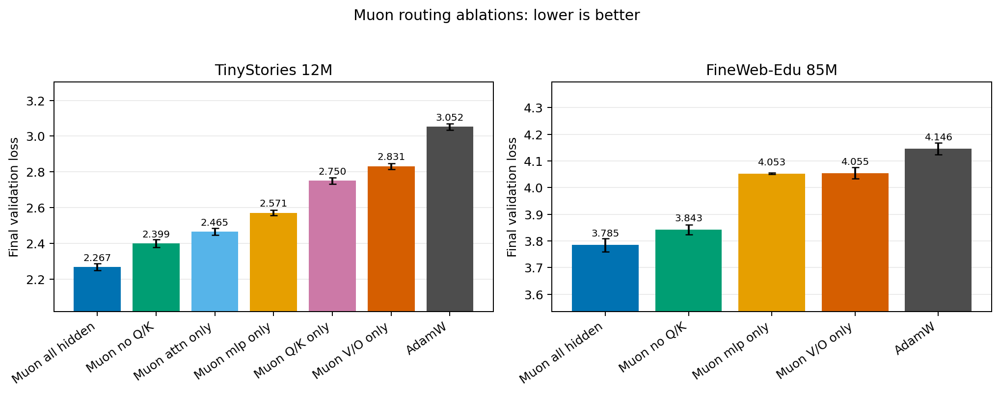
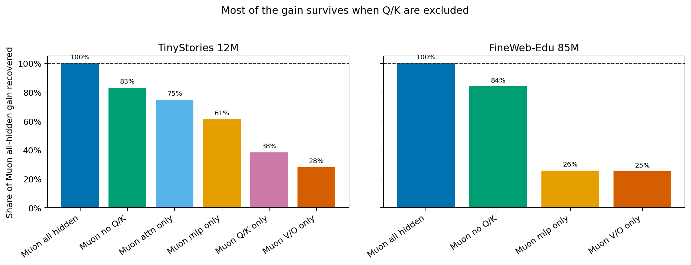
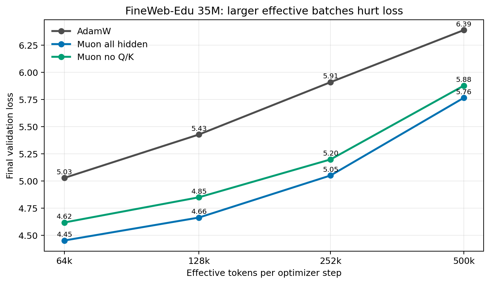
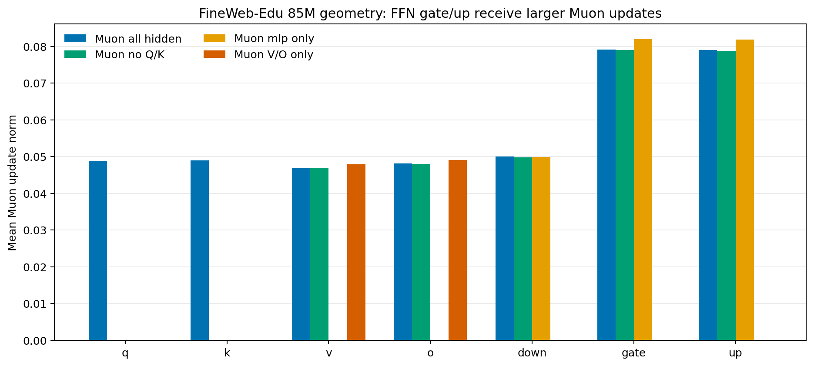

# Muon Routing Atlas: Results Summary

This note summarizes the completed experiment outputs in `runs/`. It uses final validation loss as the primary metric; lower is better. The analysis includes 41 completed runs with non-missing validation metrics.

## Main conclusion

Muon all-hidden is still the best routing. But Muon without Q/K is consistently second-best and recovers about 83-84% of the all-hidden Muon gain. The clean conclusion is:

> Most of Muon's benefit comes from non-Q/K hidden matrices, especially the combined FFN + V/O pathway. Q/K is useful, but it is supplementary rather than central in these runs.

More precisely:

- `muon_all_hidden` is the best routing in every seed-replicated main comparison.
- `muon_no_qk` is consistently second-best and recovers most of the `muon_all_hidden` gain: 83.2% on TinyStories 12M and 84.0% on FineWeb-Edu 85M.
- `muon_no_qk` does not match or beat `muon_all_hidden`, so the strongest "no-Q/K is enough" hypothesis is not supported.
- `muon_mlp_only` and `muon_vo_only` individually do not explain the FineWeb-Edu 85M gain; each recovers only about 25-26%.
- `muon_qk_only` is weak on TinyStories 12M. It improves over AdamW, but recovers only 38.4% of the all-hidden Muon gain. There is no completed FineWeb-Edu Q/K-only comparison in this run set.
- Geometry metrics show that Muon is not acting uniformly across modules: FFN `gate` and `up` matrices receive larger Muon update norms than attention V/O matrices.





## Core answer

The original research question was:

> Does Muon need to be applied to all hidden transformer matrices, or can it be routed selectively?

The answer from these results is:

> Selective routing works surprisingly well, but it does not fully beat all-hidden Muon.

| Claim | Result |
|---|---|
| Muon beats AdamW | Yes, strongly |
| Muon all-hidden is best | Yes |
| Muon no-Q/K matches all-hidden | No |
| Muon no-Q/K recovers most gain | Yes, about 83-84% |
| Q/K-only is useless | No, but it is weak |
| MLP-only or V/O-only alone explain everything | No |
| FFN + V/O together are very important | Yes |

## Seed-replicated comparisons

Gain recovered is defined as:

```text
(AdamW final loss - routing final loss) / (AdamW final loss - Muon all-hidden final loss)
```

### TinyStories 12M

TinyStories gives the clearest full routing sweep. The ranking is:

```text
muon_all_hidden  best
muon_no_qk       second
muon_attn_only   third
muon_mlp_only    fourth
muon_qk_only     fifth
muon_vo_only     sixth
adamw_all        worst
```

| Routing | Seeds | Final validation loss | Gain vs AdamW | Gain recovered |
|---|---:|---:|---:|---:|
| `muon_all_hidden` | 2 | 2.2672 +/- 0.0188 | 0.7850 | 100.0% |
| `muon_no_qk` | 2 | 2.3992 +/- 0.0229 | 0.6530 | 83.2% |
| `muon_attn_only` | 2 | 2.4650 +/- 0.0194 | 0.5872 | 74.8% |
| `muon_mlp_only` | 2 | 2.5710 +/- 0.0158 | 0.4812 | 61.3% |
| `muon_qk_only` | 2 | 2.7504 +/- 0.0177 | 0.3018 | 38.4% |
| `muon_vo_only` | 2 | 2.8312 +/- 0.0174 | 0.2210 | 28.1% |
| `adamw_all` | 2 | 3.0522 +/- 0.0176 | 0.0000 | 0.0% |

Inference:

> On TinyStories, Muon helps almost everywhere, but all-hidden is clearly best. No-Q/K is close but still worse. Attention-only is surprisingly strong, MLP-only is also strong, and V/O-only alone is weak.

TinyStories does not support a simple statement like "only FFN matters" or "only V/O matters." The modules appear to interact.

### FineWeb-Edu 85M

FineWeb-Edu is the more realistic dataset. The ranking is:

```text
muon_all_hidden  best
muon_no_qk       second
muon_mlp_only    tied-ish third
muon_vo_only     tied-ish third
adamw_all        worst
```

| Routing | Seeds | Final validation loss | Gain vs AdamW | Gain recovered |
|---|---:|---:|---:|---:|
| `muon_all_hidden` | 2 | 3.7848 +/- 0.0242 | 0.3610 | 100.0% |
| `muon_no_qk` | 2 | 3.8425 +/- 0.0182 | 0.3032 | 84.0% |
| `muon_mlp_only` | 2 | 4.0526 +/- 0.0030 | 0.0931 | 25.8% |
| `muon_vo_only` | 2 | 4.0547 +/- 0.0213 | 0.0910 | 25.2% |
| `adamw_all` | 2 | 4.1458 +/- 0.0222 | 0.0000 | 0.0% |

Inference:

> On realistic text, MLP-only and V/O-only individually are weak, but MLP + V/O together are strong.

The key comparison is:

```text
MLP-only recovers 25.8%
V/O-only recovers 25.2%
No-Q/K recovers   84.0%
```

This is the most interesting result. It suggests that Muon's useful effect is not isolated to one individual module. Instead, it appears to emerge from the combined FFN + V/O pathway.

## What happened to Q/K?

Q/K is not the main source of Muon's gains, but it is not dead weight either.

On TinyStories, `muon_qk_only` recovers 38.4% of the all-hidden Muon gain. That is much weaker than all-hidden or no-Q/K, but it still beats AdamW.

The subtle point is:

- If Q/K were useless, then `muon_no_qk` would match `muon_all_hidden`.
- But `muon_no_qk` is consistently worse than `muon_all_hidden`.
- Therefore, Q/K contributes some extra improvement in the full routing.
- However, Q/K-only is too weak to explain the overall Muon advantage.

The correct summary is:

> Q/K appears supplementary, not central.

Do not summarize this result as "Q/K hurts." These runs do not support that. They support "Q/K-only is weak; full-hidden with Q/K is still best."

## Module interactions

The biggest scientific inference is that module contributions are not independent.

On FineWeb-Edu 85M:

```text
MLP-only: 25.8% gain recovered
V/O-only: 25.2% gain recovered
No-Q/K:   84.0% gain recovered
```

If modules combined in a simple additive way, MLP + V/O might recover around 50%. Instead, no-Q/K recovers 84%. That suggests Muon's effect is not just "apply it to one important matrix." It seems to require a connected pathway through FFN and V/O modules.

In transformer terms:

- V/O controls what information attention writes back into the residual stream.
- FFN transforms, expands, gates, and recombines information inside each token position.
- Together, V/O + FFN may form a larger feature-update pathway.
- Muon seems especially useful when applied across that pathway.

This is directionally consistent with the external claim that Muon's advantage is tied to associative-memory-like transformer components such as Value/Output attention weights and FFNs: <https://openreview.net/forum?id=twbMFL0DMp>.

## Batch-size sensitivity

FineWeb-Edu 35M runs form an effective-batch sweep. Loss worsens as effective tokens per optimizer step increase, even though throughput slightly improves. The relative ordering remains stable: `muon_all_hidden` is best, `muon_no_qk` is second, and AdamW is worst.



| Effective tokens / step | AdamW | Muon all-hidden | Muon no-Q/K |
|---:|---:|---:|---:|
| 65,536 | 5.0273 | 4.4517 | 4.6173 |
| 131,072 | 5.4269 | 4.6628 | 4.8493 |
| 258,048 | 5.9085 | 5.0500 | 5.1976 |
| 512,000 | 6.3870 | 5.7640 | 5.8762 |

Inference:

> Bigger effective batch worsened absolute validation loss in this setup, but it did not change the optimizer ranking.

Muon remains better than AdamW across these batch sizes, but these runs do not show that Muon solves large-batch degradation. All methods worsen as effective batch grows under this fixed setup.

## Geometry

The clearest geometry signal is in update norms. On FineWeb-Edu 85M, Muon update norms are larger for FFN `gate` and `up` matrices than for attention V/O matrices.



Approximate mean update norms for `muon_all_hidden` on FineWeb-Edu 85M:

| Module | Mean update norm |
|---|---:|
| `attn.q_proj` | 0.0490 |
| `attn.k_proj` | 0.0489 |
| `attn.v_proj` | 0.0468 |
| `attn.o_proj` | 0.0481 |
| `mlp.down_proj` | 0.0501 |
| `mlp.gate_proj` | 0.0791 |
| `mlp.up_proj` | 0.0790 |

The `mlp.gate_proj` and `mlp.up_proj` update norms are about 1.6-1.7x larger than the V/O or Q/K modules. This supports a refined interpretation:

> V/O matters functionally, but FFN gate/up matrices may be where Muon applies the strongest update pressure.

The geometry result does not say "V/O and FFN are equal." It says FFN and V/O both matter, but they behave differently under Muon.

## Interpretation of the original claims

| Original claim | Final status | Correct interpretation |
|---|---|---|
| No-Q/K matches or beats all-hidden | Not supported | No-Q/K is second-best, not best |
| MLP + V/O recovers almost all gain | Mostly supported | No-Q/K recovers 83-84% |
| Q/K-only does little or hurts | Partially supported | Q/K-only is weak, but still beats AdamW on TinyStories |
| Geometry shows FFN and V/O differ | Supported | Gate/up update norms are much larger than V/O |

## Strongest claims

These claims are supported by the current run set:

- Muon all-hidden consistently outperforms AdamW.
- No-Q/K routing recovers most, but not all, of all-hidden Muon's gain.
- MLP-only and V/O-only are individually insufficient on FineWeb-Edu 85M.
- The FFN + V/O pathway appears more important than either FFN or V/O alone.
- Q/K-only is weak, but not useless.
- Muon's update geometry differs by module.

## Claims to avoid

Do not claim:

- "No-Q/K is better than all-hidden Muon." The results say all-hidden is best.
- "Q/K hurts." Q/K-only is weak, but full-hidden with Q/K is still best.
- "V/O alone explains Muon." V/O-only recovers only 25.2% on FineWeb-Edu 85M.
- "MLP alone explains Muon." MLP-only recovers only 25.8% on FineWeb-Edu 85M.
- "This is statistically final." Most main comparisons have two seeds.

## Missing experiments

The most important missing run is:

```text
dataset = FineWeb-Edu
model = 85M
routing = muon_qk_only
seeds = 0, 1
```

This matters because the Q/K-only conclusion currently comes from TinyStories.

The second missing run is:

```text
dataset = FineWeb-Edu
model = 85M
routing = muon_attn_only
seeds = 0, 1
```

TinyStories attention-only was strong, so the FineWeb-Edu attention-only result would clarify whether that pattern survives on realistic text.

## Recommended next steps

1. Run FineWeb-Edu 85M Q/K-only.
2. Run FineWeb-Edu 85M attention-only.
3. Add one more seed for the main five variants.
4. Add confidence intervals or error bars in the report.
5. Add a pathway-interaction section: MLP-only + V/O-only vs no-Q/K.
6. In the report, phrase the main claim as "no-Q/K recovers most of the gain," not "no-Q/K matches all-hidden."

## Caveats

- Most main comparisons have two seeds. This is enough to show a consistent ranking here, but not enough for a high-confidence statistical claim.
- FineWeb-Edu 35M entries are a batch-size sweep, not independent same-config seed replicates.
- The layerwise TinyStories 35M runs are single-seed exploratory runs. They suggest middle-layer routing can be competitive, but they should not be treated as a final ranking.
- The existing run set does not include a FineWeb-Edu Q/K-only ablation, so claims about Q/K-only on FineWeb remain untested.

## Final thesis

Muon should not be understood as uniformly helpful across all transformer matrices. Full-hidden Muon is best, but most of the gain survives when Q/K matrices are removed. The strongest interpretation is that Muon's benefit is concentrated in the combined FFN + V/O pathway, while Q/K contributes extra improvement but is not the main driver.
